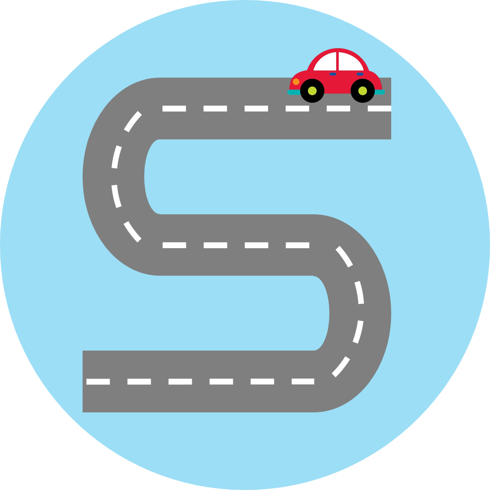

# {: width="20px" height="20px"} 애쓰지마

## 1. 프로젝트 개요

- 서비스 명 : **애쓰지마**
  <br/>
  <br/>
- 진행 기간 : 2024.01.08 ~ 2024.02.16 (6주)

<br/>

## 2. 서비스 소개

### 서비스 간단 소개

- 주차장 내에서 자리를 찾지 못하는 사용자를 위한 주차장 내 빈 자리 추천 서비스
  <br/>
  <br/>
- 센서를 활용한 실내 GPS 구현을 통해 실내 주차장에 적용 가능한 서비스 제공
  <br/>
  <br/>
- 관리자 페이지를 통한 프리셋 변경 기능과 주차장 관리 시스템 제공
  <br/>
  <br/>

### UCC

여기에 UCC를 넣을 예정
<br/>
<br/>

## 3. 기획 배경

### 배경

- 마트, 아파트, 사업장과 같은 다양한 공간에서 반복된 주차 자리 찾기로 인한 스트레스가 높음
  <br/>
  <br/>
- 기존의 서비스들은 주차장의 정보를 제공하지 않거나, 제공하더라도 자리를 추천하고 경로를 안내하지는 않음

### 타겟

- 기존에 내비게이션 어플리케이션을 이용하는 운전자
  <br/>
  <br/>
- 주차장에서 자리를 찾는데에 스트레스를 호소했던 운전자

## 🛠 4. 기술스택

Frontend

Backend + DevOps

Embedded

## 5. 주요 기능 및 서비스 화면

### 주요기능

### 시연영상

## 6. 프로젝트 산출물

[기능 명세서](https://evergreen-leopon-157.notion.site/fc07268eb9214db8aa48eca10b398ce2?v=5e438d4588d34080b0b35ff7e628083a&pvs=4)
<br/>
[요구사항 명세서](https://evergreen-leopon-157.notion.site/7a42a6fd22c54a7f9858dfbc5798f1df?v=0a5b61f4d5834201812657ddf14abd0b&pvs=4)
<br/>
[ERD](https://evergreen-leopon-157.notion.site/ERD-74cfe8c004774275ac930393dcfc358f?pvs=4)
<br/>

## 7. 팀원소개

```

```
